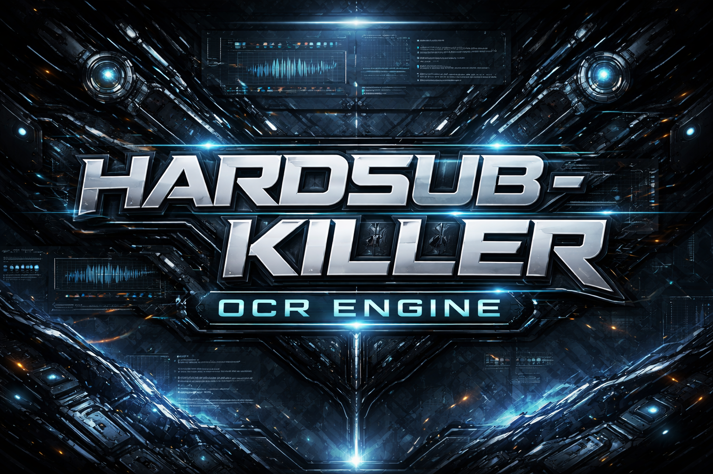

<div align="center">
  
</div>
# 💀 Hardsub-Killer OCR Engine

> Hardcoded subtitles don’t get extracted.
> They get eliminated.

---

## 🚀 What is this?

**Hardsub-Killer** is a high-performance, low-level OCR system designed to rip subtitles directly from video frames — fast, precise, and without wasting CPU cycles on garbage work.

This is NOT:

* a wrapper
* a script
* a beginner project

This is a **system built close to the metal**.

---

## ⚙️ Core Pipeline

```text
FFmpeg Decode
    ↓
SIMD Preprocessing (AVX2)
    ↓
ROI Selection
    ↓
Frame Hashing (DHash/PHash)
    ↓
Duplicate Frame Skip
    ↓
Multi-threaded OCR (Tesseract)
    ↓
Subtitle Sync (PTS → SRT/JSON)
```

---

## 🔥 Why this exists

Most OCR tools are:

* slow
* redundant
* inefficient

They:

* reprocess identical frames
* allocate memory like crazy
* ignore CPU capabilities

**This system does the opposite.**

---

## ⚡ Features

* 🎥 **Low-Level FFmpeg Decoding**
* 🧠 **Adaptive ROI (multi-zone support)**
* 🚫 **Frame Deduplication (DHash/PHash)**
* 🔬 **SIMD Acceleration (AVX2)**
* 🧵 **Multi-threaded OCR per CPU core**
* 🧱 **Custom Linear Memory Arena (zero fragmentation)**
* ⏱️ **Millisecond-accurate subtitle timing**
* 📦 Output:

  * `.srt`
  * `.json`

---

## 🧠 Performance Philosophy

> If you can skip it — skip it.
> If you can vectorize it — do it.
> If you allocate in a loop — you already lost.

---

## 🖥️ Target Hardware

Optimized for:

* Intel Core i5-10400 (6C / 12T)
* Intel UHD 630 (optional acceleration)

But scalable to anything with multiple cores and AVX2.

---

## 🧪 Tech Stack

* **C++20**
* **FFmpeg (libavcodec / libavformat)**
* **Tesseract (C++ API)**
* **AVX2 intrinsics**
* **Custom memory allocator**
* *(Optional)* Qt6 UI (glassmorphism style)

---

## 🧵 Architecture Highlights

### 🧱 Memory Arena

* Preallocated memory block
* O(1) allocation
* No fragmentation
* No `free()` during runtime

---

### 🧠 Frame Hashing

* DHash / PHash
* ROI-based comparison
* Skip frames if difference < 5%

---

### 🔬 SIMD Processing

* Custom AVX2 grayscale conversion
* Fast thresholding
* No OpenCV overhead

---

### 🧵 Multithreading

* 1 Producer (decoder)
* N Consumers (OCR workers)
* Lock-free queue

---

## ⚠️ Warning

This is NOT beginner-friendly.

If you are here for:

* “pip install something”
* easy scripts
* plug-and-play tools

→ You are in the wrong place.

---

## 🛠️ Build (Linux)

```bash
sudo apt install \
  libavcodec-dev \
  libavformat-dev \
  libtesseract-dev \
  cmake g++

git clone <repo>
cd hardsub-killer
mkdir build && cd build
cmake ..
make -j$(nproc)
```

---

## ▶️ Run

```bash
./hardsub_killer input.mp4
```

---

## 📊 Status

* [x] Core architecture
* [x] Multithreading pipeline
* [ ] SIMD optimization (in progress)
* [ ] Hash-based frame skipping
* [ ] OCR tuning
* [ ] UI layer (Qt6)

---

## 🧨 Future Plans

* GPU acceleration (VAAPI / QuickSync)
* Real-time OCR preview
* AI-assisted subtitle correction
* Plugin system

---

## 🧠 Philosophy (Final)

This project is built on one rule:

> **Performance is not optional. It is the baseline.**

---

## 👁️‍🗨️ Final Note

If you understand this code —
you are not a beginner anymore.

If you improve it —
you are dangerous.
